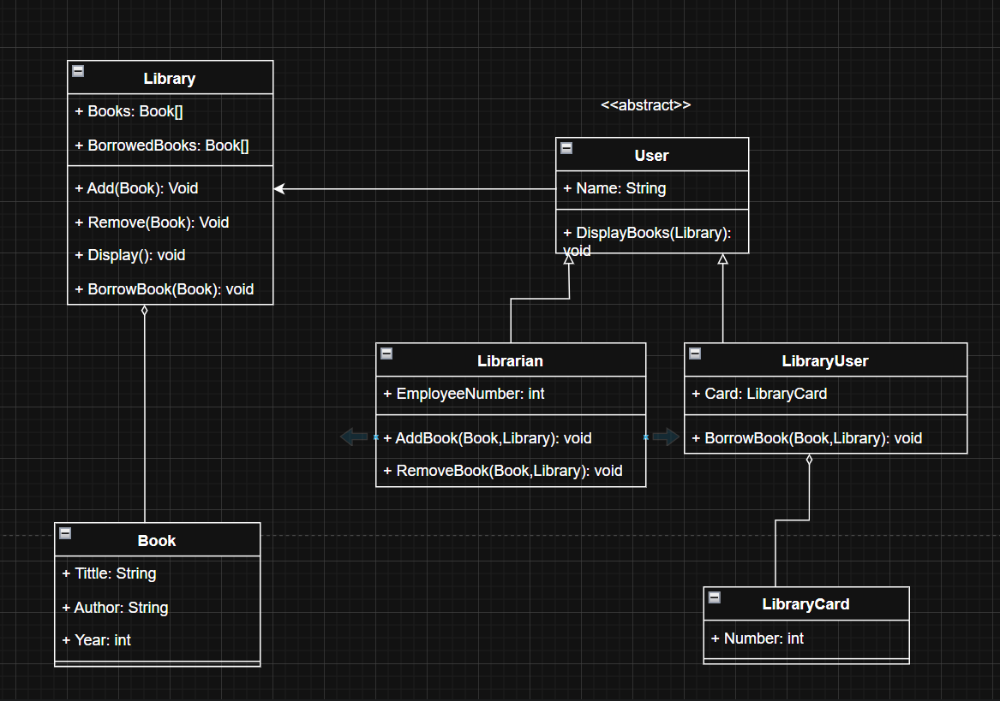

# 📚 Library Management System (Console App - C#)

A console-based **Library Management System** built in C# that allows **Librarians** and **Regular Users** to manage, borrow, and view books through an interactive console menu.  
The project is a practical implementation of **Object-Oriented Programming (OOP)** principles with a clear separation of responsibilities between classes.

---

## 📌 Features

### 👨‍💼 For Librarians

- ➕ **Add** new books by entering:
  - Title
  - Author
  - Year
- ❌ **Remove** existing books from the library
- 📋 **Display** all available books

### 👤 For Regular Users

- 📖 **Borrow** books from the library
- 📋 **View** currently available books

### 🛠 Additional Features

- **Input Validation** for strings and numeric values (using `string.IsNullOrWhiteSpace()` and `int.TryParse()`)
- Structured code using **abstraction** and **inheritance**
- Handles invalid input without crashing the program

---

## 🧠 Core Concepts Practiced

- **Object-Oriented Programming (OOP)**
  - Classes & Objects
  - Inheritance (`Librarian` & `LibraryUser` inherit from `User`)
  - Encapsulation of data and methods
- **Manual Array Management**
  - No usage of `List<>` or database — all books stored in fixed-size arrays
- **Input Validation**
  - Prevents empty or invalid book details
  - Ensures year is a valid integer and within a sensible range
- **Console Interaction**
  - Simple and intuitive menu-based interface

---

## 🏗 Class Structure

### **Main Classes**

- **`Book`** → Represents a single book (Title, Author, Year)
- **`Library`** → Stores and manages the collection of books (add, remove, borrow, display)
- **`User`** (Abstract) → Base class for all types of users
- **`Librarian`** → Can add/remove books
- **`LibraryUser`** → Can borrow books
- **`LibraryCard`** → Represents a user's library card, planned for tracking borrowed books in future updates.

---

## 🖼 UML Diagram



---

## 🚀 How to Run

1. Clone the repository or copy project files.
2. Open the project in **Visual Studio** or any C# IDE.
3. Make sure **.NET 8 SDK** is installed.
4. From project folder run:
   ```bash
   dotnet run
   ```
