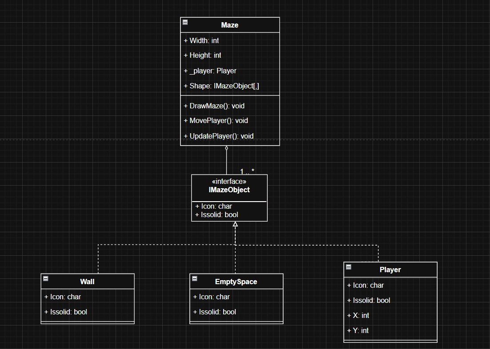
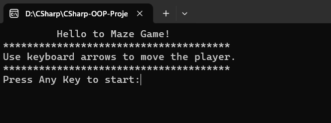
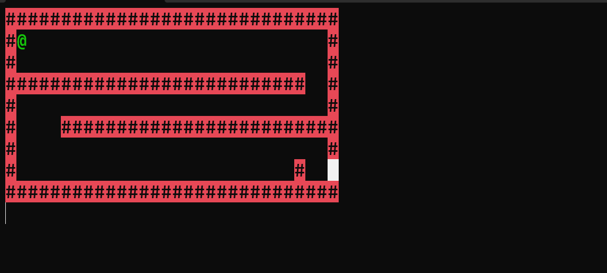
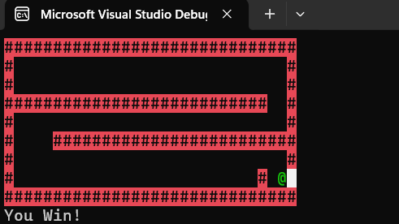

# 🎯 Maze Game (Console App - C#)  

A simple **Maze Game** built with **C#** using **Object-Oriented Programming (OOP)** principles.  
Players can move through a maze using the **arrow keys** while avoiding walls and trying to reach the exit.  

---

## 📌 Features  

### 🕹 Gameplay  
- Move the player using the arrow keys ⬆️⬇️⬅️➡️  
- Walls (`#`) block movement  
- Empty spaces (` `) can be walked through  
- The player is represented by the `@` icon  
- Exit point to win the game  

### 🛠 Technical Features  
- **OOP Structure** with interfaces and multiple classes  
- **Custom Maze Drawing** with colored walls and player  
- **Input Handling** for arrow keys  
- **Solid vs. Non-Solid Objects** through `IMazeObject` interface  

---

## 🧠 Core Concepts Practiced  
- **Interfaces** (`IMazeObject`) for common maze object behavior  
- **Encapsulation** of player and maze logic  
- **Inheritance & Polymorphism** (walls, empty spaces, player share interface)  
- **Array-based Maze Representation** (`IMazeObject[,]`)  
- **Console Color Styling** for visual clarity  

---

## 🏗 Class Structure  

| Class       | Responsibility |
|-------------|----------------|
| `IMazeObject` | Interface for all maze objects (`Icon`, `IsSolid`) |
| `EmptySpace`  | Represents an empty cell in the maze |
| `Wall`        | Represents a wall that blocks movement |
| `Player`      | Player object with position and icon |
| `Maze`        | Handles maze drawing, player movement, and collision detection |
| `Program`     | Entry point of the application |

---

## 🖼 UML Diagram  

  

---

## 🎮 Game Screenshots  

  
  
  

---

## 🚀 How to Run  

- Open the solution file (`MazeGame.sln`) in Visual Studio  
- Set the startup project to **MazeGame**  
- Run the project (F5 or "Start Debugging")  

