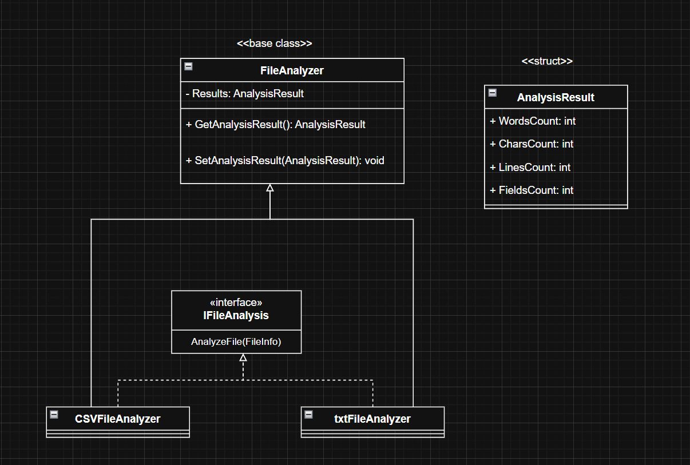

# 📊 Text Data Analyzer (Console App - C#)

A console-based **Text Data Analyzer** built in C# that allows users to analyze `.txt` and `.csv` files in a given folder.  
The project is a practical implementation of **Object-Oriented Programming (OOP)** principles with a clear and modular structure, making it easy to extend for more file types in the future.

---

## 📌 Features

### 📄 For Text Files (`.txt`)
- 📏 **Count Words** in the file
- ✍ **Count Characters** in the file
- 📜 **Count Lines** in the file

### 📊 For CSV Files (`.csv`)
- 📋 **Count Fields** (total number of comma-separated values)

### 🛠 Additional Features
- **Automatic File Type Detection** using **extension methods**
- Supports **case-insensitive** file extensions
- Structured code using **interfaces**, **inheritance**, and **polymorphism**
- Handles unsupported file types with clear error messages

---

## 🧠 Core Concepts Practiced
- **Object-Oriented Programming (OOP)**
  - Interfaces (`IFileAnalysis`)
  - Inheritance (`TxtFileAnalyzer` & `CSVFileAnalyzer` inherit from `FileAnalyzer`)
  - Encapsulation of logic in separate classes
- **Extension Methods**
  - For checking file type (`IsTextFile()`, `IsCsvFile()`)
- **File Handling**
  - Reading files using `File.ReadAllText()` and `StreamReader`
- **Error Handling**
  - Ensures invalid paths or unsupported file types don't crash the program

---

## 🏗 Class Structure

### **Main Classes**
- **`FileInfoExtensions`** → Extension methods for file type detection
- **`IFileAnalysis`** → Interface defining `AnalyzeFile()` method
- **`FileAnalyzer`** (Abstract) → Base class with result properties and `GetResults()` method
- **`TxtFileAnalyzer`** → Analyzes `.txt` files (counts words, characters, and lines)
- **`CSVFileAnalyzer`** → Analyzes `.csv` files (counts fields)
- **`Program`** → Main entry point, manages folder input and analysis workflow

---

## 🖼 UML Diagram


---

## 🚀 How to Run

1. Clone the repository or copy project files.
2. Open the project in **Visual Studio** or any C# IDE.
3. Make sure **.NET 8 SDK** is installed.
4. From the project folder run:
   ```bash
   dotnet run
